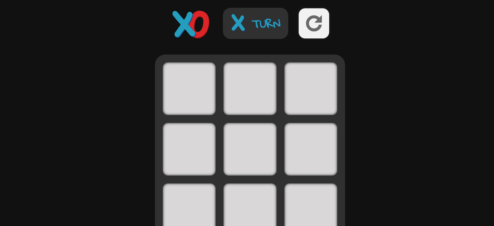
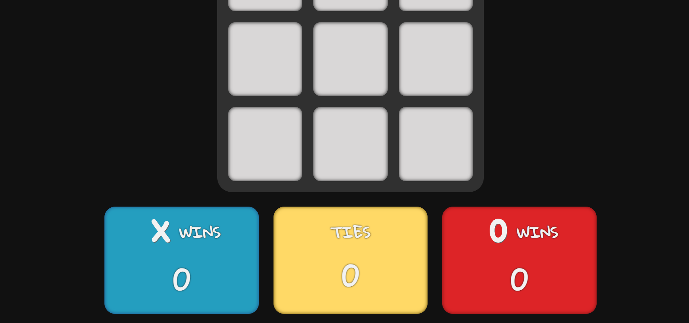

<h1 align="center" id="title">Tic Tac Toe</h1>

A tic tac toe web game. <em>This project is part of The Odin Project's <a href="https://www.theodinproject.com/lessons/node-path-javascript-tic-tac-toe" target="_blank" rel="noopener noreferrer">Fullstack JavaScript Course!</a></em>

    <a href="https://jmagali.github.io/tic-tac-toe/">View Demo</a>

## Preview

    
Top Half of The Scrren

    
    
Bottom Half of The Screen

    

## Technologies used
  &emsp;     &emsp;   

